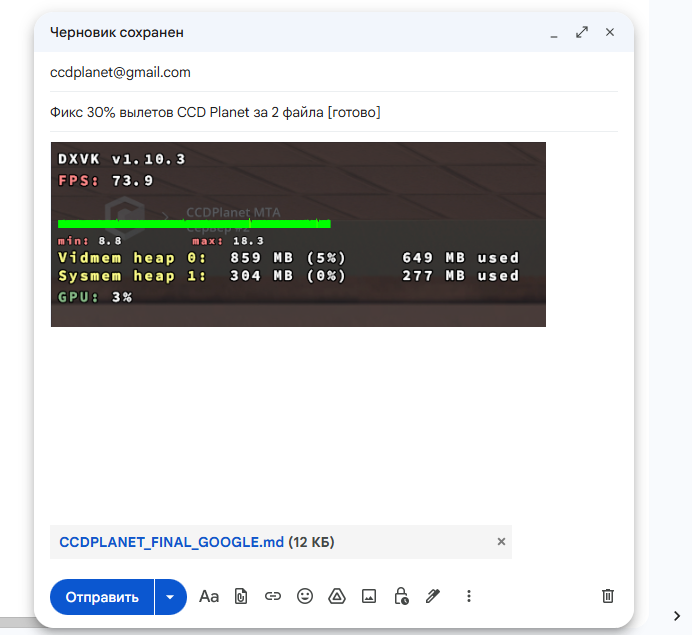

  
  <h1>⚡ MTA: VULKAN OVERDRIVE ⚡</h1>
  
  

    
    
    
    
  

  
<b>Ультимативный патч от фризов и статтеров для ЛЮБЫХ серверов MTA:SA</b>

---

## 🛑 ПОЧЕМУ MTA ЛАГАЕТ ДАЖЕ НА ТОПОВЫХ ПК?

MTA:SA работает на устаревшем API **DirectX 9 (D3D9)**. Этот движок имеет фундаментальный изъян: все вызовы отрисовки (Draw Calls) обрабатываются **строго в один поток процессора**.
Итог: ваша современная видеокарта "спит" (загрузка 3-5%), процессор задыхается, а вы получаете микрофризы на любом загруженном сервере и просадки 1% Low FPS в плотном трафике.

## 🚀 РЕШЕНИЕ: ПЕРЕХОД НА VULKAN
Мы полностью отрезаем игру от DirectX 9 и пускаем рендер через современный открытый стандарт **Vulkan**. 
Библиотека DXVK перехватывает команды D3D9 на лету и переводит их в многопоточные шейдеры. 
**Результат:** Идеально гладкий FrameTime. Никаких микрофризов при подгрузке тяжелых машин или скинов.

### Доказательство (Скриншот с RTX 5080)

  
  
<i>Обратите внимание на график: 73.9 FPS при загрузке GPU всего 3%, при этом FrameTime идеально ровный. Это недостижимо на стандартном D3D9.</i>

*(Место для вашей будущей GIF-анимации геймплея 60 FPS)*

---

## 🛠️ ИНСТРУКЦИЯ ПО УСТАНОВКЕ (ДЛЯ НОВИЧКОВ)

Установка занимает **ровно 2 минуты**. Никаких сложных программ.

### Шаг 1: Скачивание файлов
Вместо того чтобы искать правильную версию на GitHub, мы уже подготовили проверенный архив.
👉 <a href="https://github.com/Vektor010/mta-sa-vulkan-anti-lag/releases/latest"><b>СКАЧАТЬ ПОСЛЕДНИЙ РЕЛИЗ (Release Tab)</b></a>

### Шаг 2: Внедрение в игру
MTA:SA — это 32-битная игра, поэтому нам нужна строго x32 версия библиотеки.
1. Откройте скачанный архив (папка x32).
2. Найдите файл d3d9.dll.
3. Скопируйте этот файл в **корневую папку чистой GTA San Andreas** (туда, где лежит файл gta_sa.exe).
   > ⚠️ **Внимание:** Кидать нужно именно в папку обычной GTA, а не в папку самой MTA!

### Шаг 3: Настройка мониторинга (Опционально)
Чтобы увидеть график задержек (как на скриншоте выше):
1. В папке с gta_sa.exe создайте текстовый документ dxvk.conf.
2. Откройте его блокнотом и впишите строку:
   `ini
   dxvk.hud = fps,frametimes,memory,gpuload
   `
3. Сохраните. При заходе в игру вы увидите неоновый HUD разработчика.

---

## 🛡️ РЕШЕНИЕ ПРОБЛЕМ С АНТИЧИТОМ
Если при заходе на ваш сервер (например, Province, CCDPlanet, NextRP) вас кикает с ошибкой измененного d3d9.dll:
1. Попросите администрацию вашего сервера добавить хэш d3d9.dll от DXVK в **Whitelist** серверного античита MTA. Это базовая практика.
2. Официальные разработчики MTA уже работают над нативной интеграцией этого метода (см. [Официальный PR #5342](https://github.com/multitheftauto/mtasa-blue/pull/5342)).

---

  <b>Увидимся на сервере без лагов. 🚀</b>

