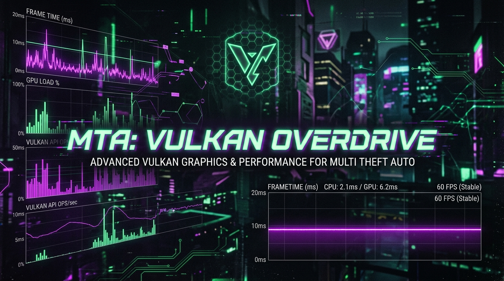
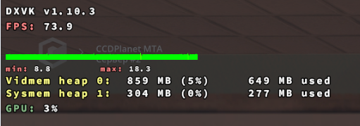

  
   
  <h1>⚡ MTA: VULKAN OVERDRIVE ⚡</h1>
  
  

    
    
    
    
  

  
<b>Ультимативный патч от фризов и статтеров для ЛЮБЫХ серверов MTA:SA</b>

---

## 🛑 ПОЧЕМУ MTA ЛАГАЕТ ДАЖЕ НА ТОПОВЫХ ПК?

MTA:SA работает на устаревшем API **DirectX 9 (D3D9)**. Этот движок имеет фундаментальный изъян: все вызовы отрисовки (Draw Calls) обрабатываются **строго в один поток процессора**.
Итог: ваша современная видеокарта "спит" (загрузка 3-5%), процессор задыхается, а вы получаете микрофризы на любом загруженном сервере и просадки 1% Low FPS в плотном трафике.

## 🚀 РЕШЕНИЕ: ПЕРЕХОД НА VULKAN
Мы полностью отрезаем игру от DirectX 9 и пускаем рендер через современный открытый стандарт **Vulkan**. 
Библиотека DXVK перехватывает команды D3D9 на лету и переводит их в многопоточные шейдеры. 
**Результат:** Идеально гладкий FrameTime. Никаких микрофризов при подгрузке тяжелых машин или скинов.

### Декодирование телеметрии (Для новичков)

  
    
  <table style="border: 1px solid #ff00ff;">
    <tr>
      <td>🟢 <b>Зеленая линия (FrameTime):</b></td>
      <td>Пульс игры. Если линия идеально ровная — движок работает плавно, <b>без единого микрофриза</b> даже на Б/У рынке. На старом DirectX 9 эта линия выглядит как пила, вызывая дерганую картинку.</td>
    </tr>
    <tr>
      <td>🧊 <b>GPU: 3% (Разгрузка железа):</b></td>
      <td>Видеокарта практически "спит". Vulkan забирает нагрузку с одного ядра процессора и распараллеливает её. Ваша видеокарта больше не ждет процессор — игра летает, а температуры ПК падают.</td>
    </tr>
    <tr>
      <td>🚀 <b>FPS 73.9 (Серверный лок):</b></td>
      <td>Идеально стабильный фреймрейт. Он упирается <b>исключительно в жесткие лимиты самого сервера</b>, не проседая ни на один кадр при любых нагрузках. Никаких просадок в толпе машин.</td>
    </tr>
  </table>

---

## 🛠️ ИНСТРУКЦИЯ ПО УСТАНОВКЕ (ДЛЯ НОВИЧКОВ)

Установка занимает **ровно 2 минуты**. Никаких сложных программ.

### Шаг 1: Скачивание файлов
Мы подготовили готовый архив, в котором уже лежит нужная версия Vulkan и файл конфигурации для мониторинга (график FPS).
👉 <a href="https://github.com/Vektor010/mta-sa-vulkan-anti-lag/releases/download/v1.10.3-mta/MTA_Vulkan_Patch.zip"><b>СКАЧАТЬ ГОТОВЫЙ ПАТЧ (MTA_Vulkan_Patch.zip)</b></a>

### Шаг 2: Внедрение в игру
MTA:SA — это 32-битная игра, поэтому в нашем архиве лежит строго нужная версия.
1. Откройте скачанный архив MTA_Vulkan_Patch.zip.
2. Вы увидите два файла: d3d9.dll и dxvk.conf.
3. Просто скопируйте оба файла в **корневую папку чистой GTA San Andreas** (туда, где лежит файл gta_sa.exe).
   > ⚠️ **Внимание:** Кидать нужно именно в папку обычной GTA, а не в папку самой MTA!

Всё! При заходе в игру вы сразу увидите неоновый HUD с графиком FPS и ровным временем кадра.

---

## 🛡️ РЕШЕНИЕ ПРОБЛЕМ С АНТИЧИТОМ
Если при заходе на ваш сервер (например, Province, CCDPlanet, NextRP) вас кикает с ошибкой измененного d3d9.dll:
1. Попросите администрацию вашего сервера добавить хэш d3d9.dll от DXVK в **Whitelist** серверного античита MTA. Это базовая практика.
2. Официальные разработчики MTA уже работают над нативной интеграцией этого метода (см. [Официальный PR #5342](https://github.com/multitheftauto/mtasa-blue/pull/5342)).

---

  <b>Увидимся на сервере без лагов. 🚀</b>

